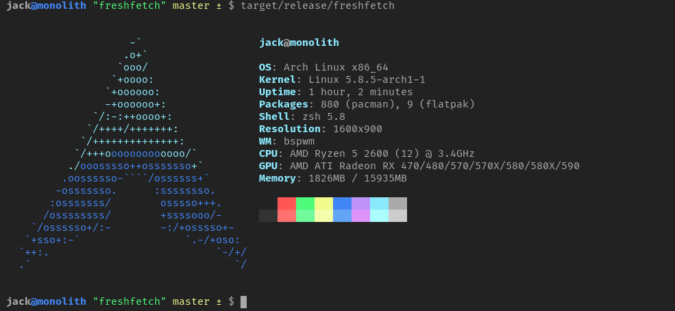
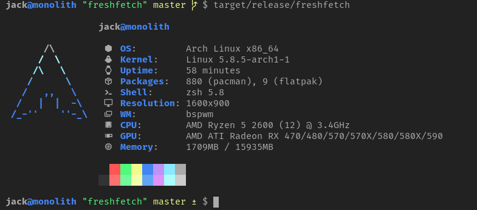
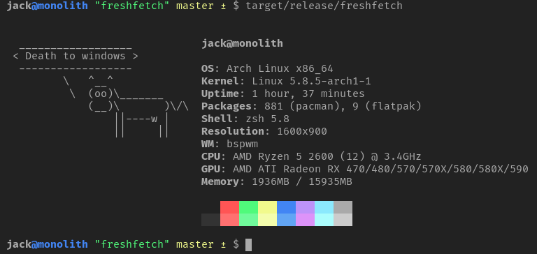

<h2 align="center">Freshfetch</h2>

<i>A fresh take on Neofetch</i>
 
 

Freshfetch is an alternative to [Neofetch](https://github.com/dylanaraps/neofetch)
written in Rust with a focus on customization.

### Warning:
Freshfetch is not to a "completed" state yet. Right now, it's in a "beta" of
sorts, with a lot of room for optimization and improvement. If you run into any
problems, be sure to file an issue so that it can be fixed!

### Todo:

 - Optimizations galore
 - Documentation :sweat:
 - Support for images
 - Better portability
 - Add colorization for all distros (69/261 complete)

